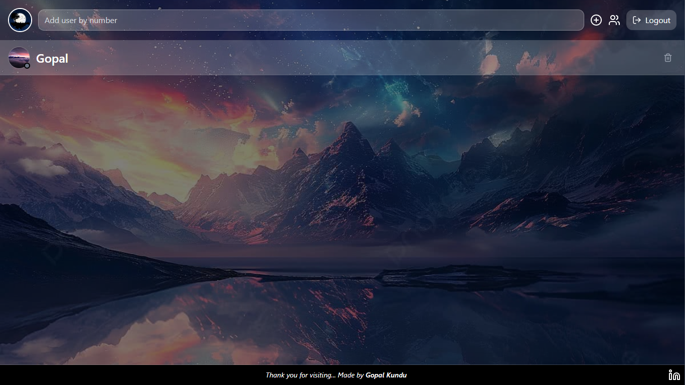
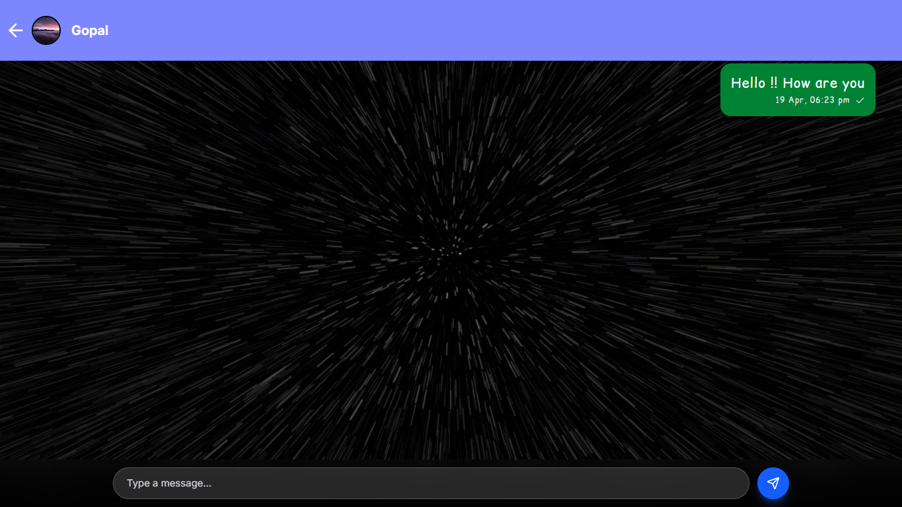
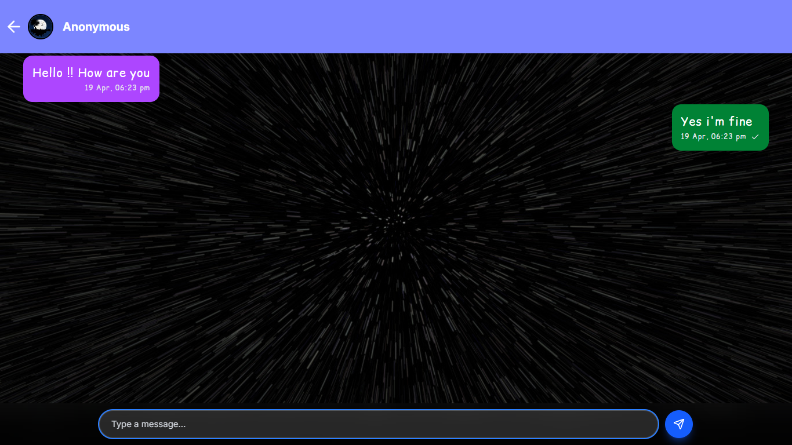
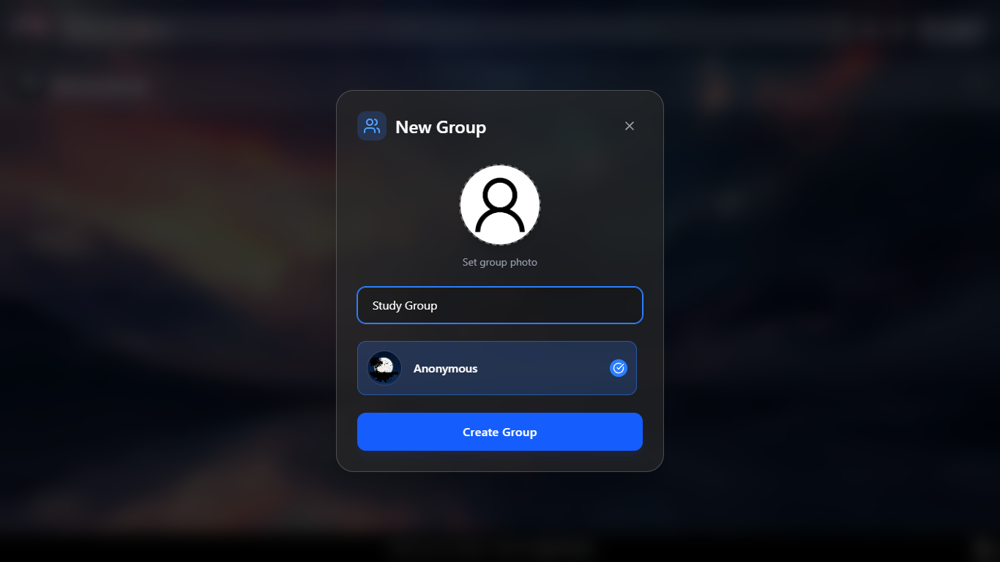
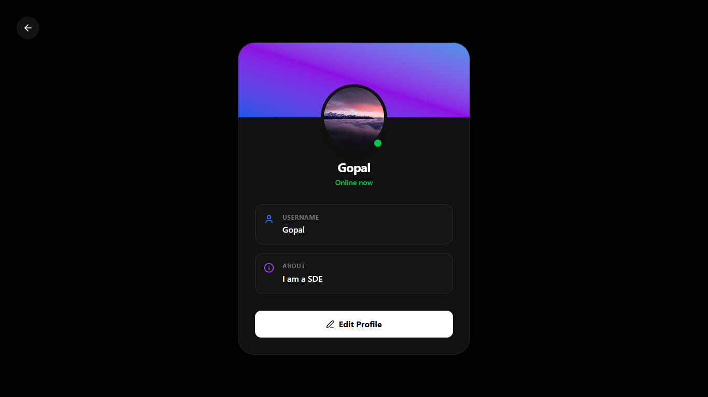

# ChatNow Web App 🚀

Welcome to **ChatNow**, a full-stack real-time chat application designed to provide seamless communication with an intuitive user interface. Whether you want to chat one-on-one or hang out in group chats, ChatNow has you covered!

## 📸 Screenshots & Previews

### Welcome Page


### Sender's Homescreen


### Sender Sending Message


### Receiver's Homescreen


### Receiver Sending Message


### Creating Group Section


### User Profile


---

## ✨ Features

- **Real-Time Communication**: Instant messaging powered by **Socket.io** for lightning-fast delivery.
- **One-on-One Chats**: Have private conversations with other registered users securely.
- **Group Chats**: Create groups, add members, and chat with multiple people at once. Includes group profile management.
- **User Authentication**: Secure Login & Signup features using JWT (JSON Web Tokens) and bcrypt for password hashing.
- **Profile Management**: Update your user profile and view others' profiles seamlessly. Image uploads supported via Cloudinary & Multer.
- **Online/Offline Status**: Real-time indicators showing whether a user is currently active.
- **Modern & Responsive UI**: Built with React 19, Vite, and styled gorgeously using Tailwind CSS for a premium feel on any device.
- **Toast Notifications**: Get intuitive, non-intrusive alerts for events like new messages or login status via Sonner.

---

## 🛠️ Tech Stack

### Frontend
- **Framework**: React 19, Vite
- **Styling**: Tailwind CSS
- **State Management**: Redux Toolkit
- **Routing**: React Router DOM
- **Real-Time Client**: Socket.io-client
- **Icons**: Lucide React
- **Notifications**: Sonner

### Backend
- **Runtime**: Node.js
- **Framework**: Express.js
- **Database**: MongoDB with Mongoose
- **Real-Time Server**: Socket.io
- **Authentication**: JWT, bcrypt
- **File Uploads**: Cloudinary, Multer, DataURI

---

## 🚀 Getting Started

To get a local copy up and running, follow these simple steps:

### Prerequisites
Make sure you have Node.js and npm installed on your machine.

### Installation

1. Clone the repository
   ```bash
   git clone <your-repo-url>
   ```
2. Setup the **Backend**
   ```bash
   cd backend
   npm install
   ```
   *Create a `.env` file in the `backend` directory and add your MongoDB URI, JWT Secret, Cloudinary credentials, and Client URL.*

3. Setup the **Frontend**
   ```bash
   cd ../frontend
   npm install
   ```
   *Create a `.env` file in the `frontend` directory (if required) or just set the API URLs in your configs.*

4. **Run the Application**
   - Start the backend server:
     ```bash
     cd backend
     npm run dev
     ```
   - Start the frontend development server:
     ```bash
     cd frontend
     npm run dev
     ```

## 🤝 Contributing
Contributions, issues, and feature requests are welcome!

